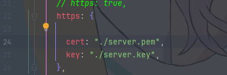
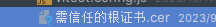
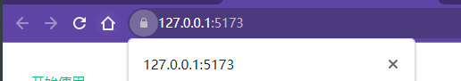

# 项目技术
- vite4
- vue3
- vue-router
- axios
- crypto
- pinia
- element-plus
- AVUE
- ....................

# 开发环境开启了https+自定义证书

# 浏览器会提示不安全，需要手动信任证书

# 安装后重启浏览器

# 你也可以 无视 (浏览器会提示不安全),或者注释掉 vite.config的https

